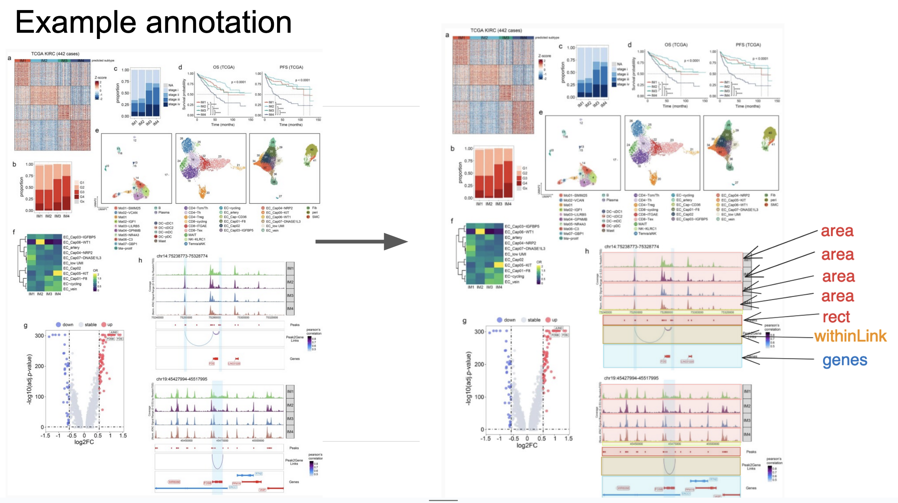

# Nature Genetics labeled genomics visualizations

1. Download figures from 100 Nature Genetics papers. 
2. For each figure that contains a genomics visualization, label each track in the visualization.

# Setup
Clone the repo then do
```bash
python -m venv .venv
source .venv/bin/activate
pip install -r requirements.txt
unzip images.zip
```

